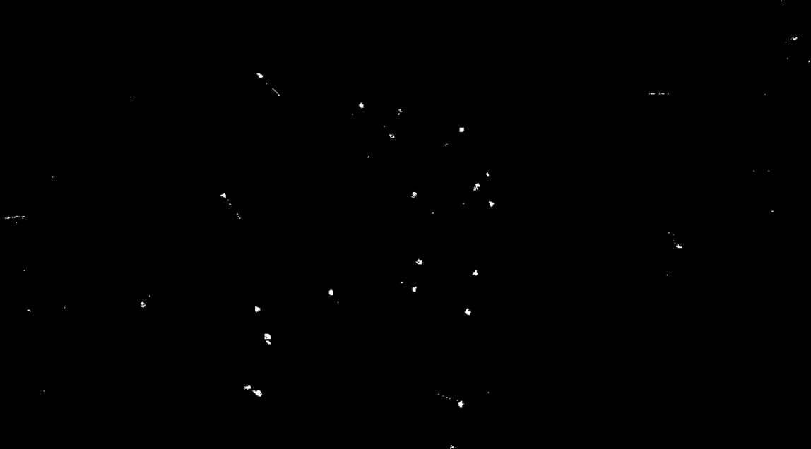

# notebook.videoanalysis

### Introduction
WIP - trying to detect and track objects on an aerial video

#### Starting date
dec 2023

#### Context
WIP - video is from a soccer game and I aim to detect the players and the ball
WIP - decided to do some analysis with a tennis match as well

#### Results

basic frame of the video:

    

masking frame of the video:

    

detecting contours within the video:

    

tennis match > variety in treshold of the masking (image 1) and the impact on the detection (image 2)

    

    

#### Application

#### Tech and Tools
OpenCV